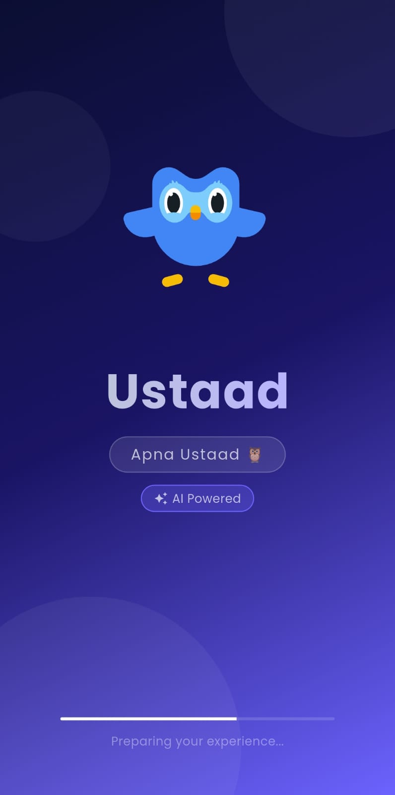
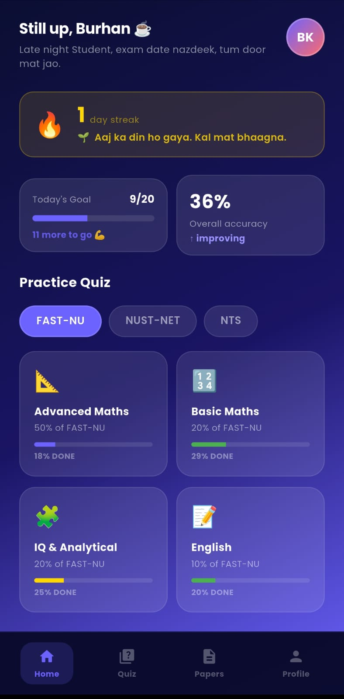
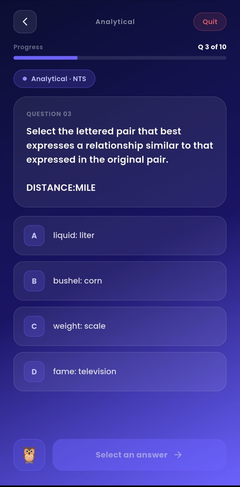
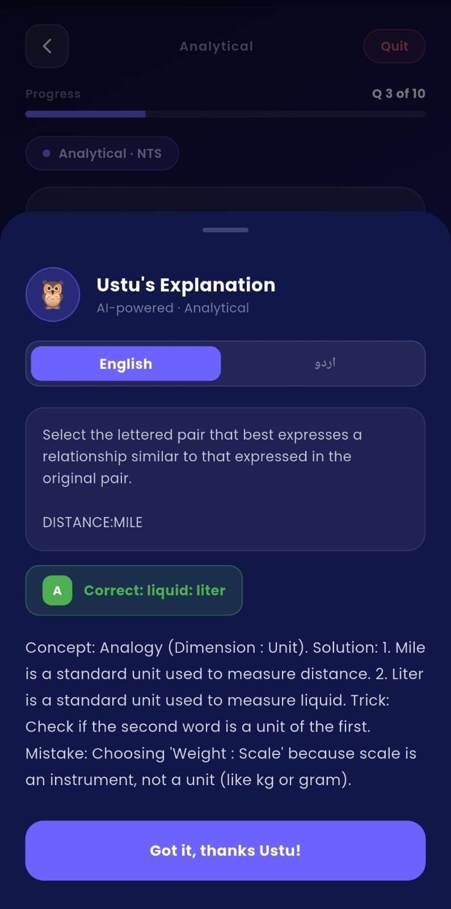
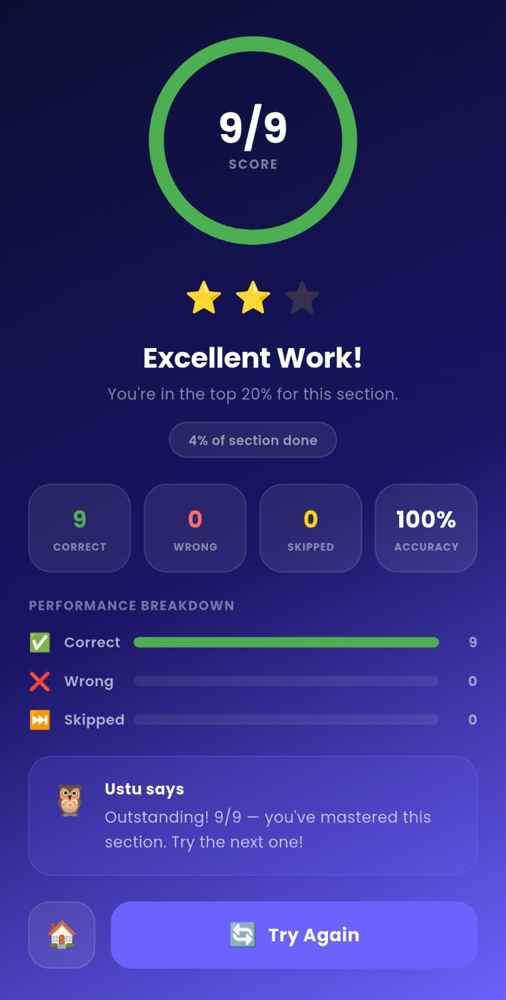
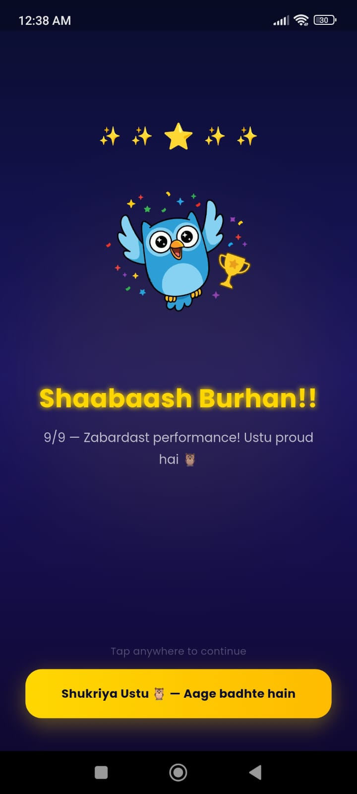
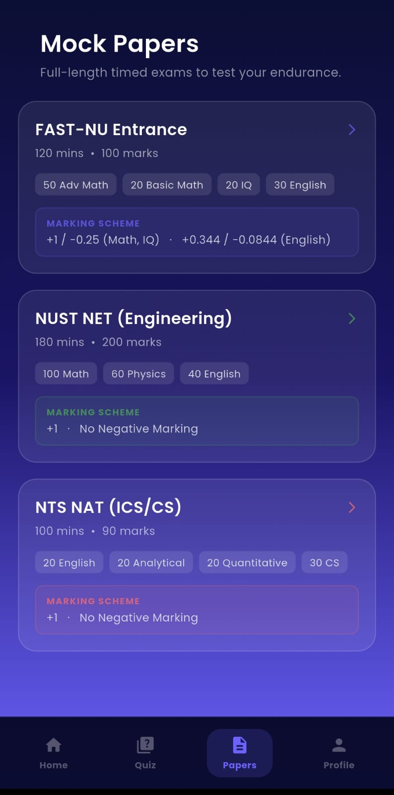
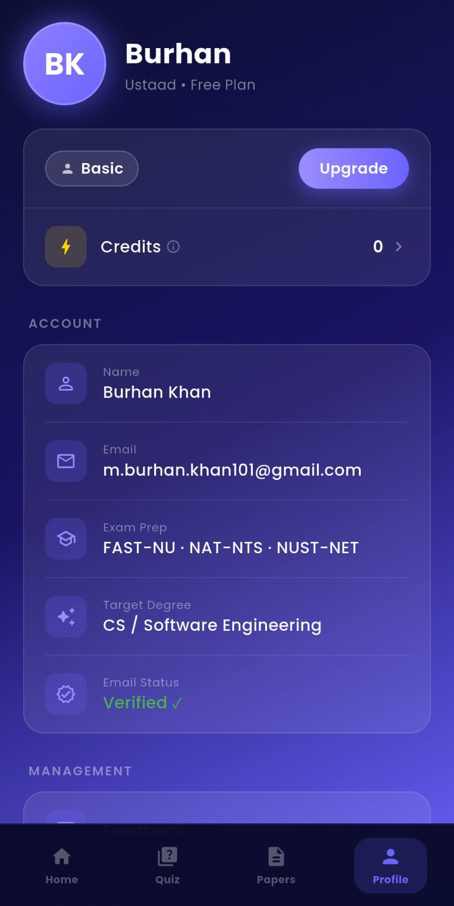

<div align="center">

# 🦉 Ustaad — Apna Ustaad

**AI-powered exam prep for Pakistani university students**  
Crush FAST-NU, NUST-NET & NTS with past papers, instant AI explanations, and smart progress tracking.

[](https://flutter.dev)
[](https://firebase.google.com)
[](https://riverpod.dev)
[](https://deepmind.google/technologies/gemini)
[](https://play.google.com)
[](LICENSE)

🌐 **[ustaadapp.online](https://ustaadapp.online)** — Live landing page with deep link into the app

</div>

---

## What is Ustaad?

Pakistani students preparing for FAST-NU, NUST-NET, and NTS have one big problem: past papers exist, but no one explains *why* an answer is wrong. They guess, move on, and repeat mistakes.

Ustaad solves this. Practice MCQs from real past papers, get instant AI explanations in **English or Urdu**, track your weak topics, and build a daily streak — all in one app built specifically for the Pakistani exam season.

> **Mascot:** Ustu the Owl 🦉 — your personal tutor in your pocket.

---

## Screenshots

> *(Add screenshots here — recommended: Splash, Home, Quiz, Explanation Sheet, Results, Progress)*

| Splash | Home | Quiz | Explanation |
|--------|------|------|-------------|
|  |  |  |  |

| Results | Progress | Papers | Profile |
|---------|----------|--------|---------|
|  |  |  |  |

---

## Features

### Core
- 📄 **Past Papers Browser** — Browse FAST-NU, NUST-NET & NTS papers by year and subject
- 🧠 **AI Explanations** — Google Gemini explains each MCQ in English or Urdu, per attempt
- ⏱️ **Timed Quiz Mode** — Practice mode with instant feedback after each question
- 📝 **Mock Paper Mode** — Full exam simulation with negative marking, section timers, and auto-submit

### Smart Learning
- 🔥 **Streak System** — Daily streak with dynamic copy that reacts to your progress
- 📊 **Weak Topic Tracker** — Automatically detects your pain points after every quiz and serves targeted practice
- 🎯 **Daily Goal Bar** — 20-question daily target with visual progress (Zeigarnik effect — you *will* finish it)
- ↩️ **Continue Where You Left Off** — Incomplete sessions are saved and surfaced on home screen

### UX Polish
- 💀 **Skeleton Loading UI** — No spinners; proper skeleton screens while Firebase fetches data
- 🌙 **Gradient Design System** — Consistent `#0A0E2E → #1A1464 → #6C63FF` across all screens
- 🦉 **Ustu Mascot** — Contextual owl character that appears for nudges and alerts
- 🌐 **Landscape / Web Mode** — Responsive layout adapts to horizontal orientation
- 🔔 **Push Notifications (FCM)** — Daily 8pm reminders, streak protection alerts, weak topic nudges

### Exam Coverage
| Exam | Subjects | Format |
|------|----------|--------|
| **FAST-NU** | CS / AI / SE / EE / DS / Business | 120 MCQs, 120 min, negative marking, 4 sections |
| **NUST-NET** | Engineering / CS / Business | 200 MCQs, 180 min, no negative marking |
| **NTS** | CS / General | 90 MCQs, 100 min, booklet selection, paginated |

---

## Tech Stack

```
Language:        Dart
Framework:       Flutter (cross-platform Android & iOS)
State Mgmt:      Riverpod ^2.0.0 (clean architecture)
Navigation:      Flutter Navigator (GoRouter planned)

Backend:
  Auth:          Firebase Authentication (Email + Google Sign-In)
  Database:      Cloud Firestore (asia-south1 — Mumbai, closest to Pakistan)
  Storage:       Firebase Storage
  Notifications: Firebase Cloud Messaging (FCM)

AI:              Google Gemini API (bilingual MCQ explanations)
Web:             Next.js landing page — ustaadapp.online
Animations:      Lottie
Fonts:           Poppins (all weights)
```

---

## Architecture

```
lib/
├── core/
│   ├── theme/
│   │   └── app_theme.dart          ← colors, fonts, button styles
│   └── constants/
│       ├── app_strings.dart        ← all text (no hardcoded strings)
│       └── app_assets.dart         ← asset paths
│
├── models/
│   ├── user_model.dart
│   ├── question_model.dart
│   ├── paper_model.dart
│   └── progress_model.dart
│
├── services/
│   ├── auth_service.dart           ← Firebase Auth calls
│   ├── firestore_service.dart      ← Firestore CRUD
│   └── gemini_service.dart         ← Gemini API calls
│
├── providers/                      ← Riverpod providers
│   ├── auth_provider.dart
│   ├── quiz_provider.dart
│   ├── papers_provider.dart
│   └── progress_provider.dart
│
└── screens/
    ├── splash/
    ├── onboarding/
    ├── auth/                       ← login, signup, email verify, test selection
    ├── home/
    ├── quiz/                       ← quiz screen, results, option/question widgets
    ├── explanation/                ← AI explanation bottom sheet
    ├── papers/                     ← paper browser + paper detail
    ├── progress/
    └── profile/
```

**Key architectural decisions:**
- Riverpod over Provider/GetX/BLoC — scales well, industry standard
- Business logic fully decoupled from UI via providers + services
- All text in `AppStrings`, all colors in `UstaadColors` — no magic values in widgets
- Firestore location `asia-south1` (Mumbai) — lowest latency for Pakistani users

---

## Screens Built

```
✅ SplashScreen          Lottie owl animation, gradient bg, auto-nav
✅ OnboardingScreen      3 slides, shifting gradients, swipeable PageView
✅ LoginScreen           Email/password + Google Sign-In, Firebase Auth
✅ SignupScreen          Password strength bar, requirements checklist
✅ VerifyEmailScreen     Auto-polls every 3s, 60s resend timer
✅ TestSelectionScreen   Pick FAST-NU / NUST-NET / NTS after signup
✅ HomeScreen            Dashboard, stats, daily goal, streak, weak topic alerts
✅ QuizScreen            MCQ solving — instant feedback, timer, Ustu available
✅ ResultScreen          Score, accuracy, retry / home navigation
✅ ExplanationSheet      AI explanation bottom sheet (English / Urdu)
✅ ProgressScreen        Streaks, accuracy chart, weak topics
✅ ProfileScreen         Settings, test change, logout, privacy policy
✅ PapersScreen          Browse past papers by year and subject
✅ PaperDetailScreen     Question list for a selected paper
✅ FeedbackScreen        Users can submit their Feedbacks
```

---

## Getting Started

### Prerequisites
- Flutter SDK `>=3.0.0`
- Dart `>=3.0.0`
- Firebase project with `google-services.json`
- Google Gemini API key

### Setup

```bash
# 1. Clone the repo
git clone https://github.com/mburhankhan101-glitch/ustaad.git
cd ustaad

# 2. Install dependencies
flutter pub get

# 3. Add your Firebase config
# Place google-services.json in android/app/
# (not committed — see .gitignore)

# 4. Add your Gemini API key
# Create lib/core/constants/env.dart:
# const String geminiApiKey = 'YOUR_KEY_HERE';

# 5. Run
flutter run
```

> **Note:** `google-services.json` and API keys are excluded from this repo via `.gitignore`. You'll need your own Firebase project and Gemini API key to run locally.

---

## Color Palette

| Role | Hex | Preview |
|------|-----|---------|
| Background Start | `#0A0E2E` |  |
| Background End | `#6C63FF` |  |
| Primary | `#6C63FF` |  |
| Accent / Error | `#FF6B6B` |  |
| Success | `#4CAF50` |  |
| Gold | `#FFD700` |  |

---

## Exam Paper Specifications

<details>
<summary><strong>FAST-NU (CS / AI / SE / EE / DS)</strong></summary>

- 120 MCQs | 120 minutes | Sectioned timer | Negative marking
- 50 Advanced Maths (+1 / −0.25)
- 20 Basic Maths (+1 / −0.25)
- 20 Analytical & IQ (+1 / −0.25)
- 30 English (+0.344 / −0.0844)
- Sections are random-ordered. Once you move to the next section, you cannot return.
- Paper auto-submits when time expires.

</details>

<details>
<summary><strong>NUST-NET (Engineering / CS)</strong></summary>

- 200 MCQs | 180 minutes | No negative marking
- 100 Maths
- 60 Physics
- 40 English

</details>

<details>
<summary><strong>NTS (CS / General)</strong></summary>

- 90 MCQs | 100 minutes | No negative marking
- Physical booklet simulation (4 colour variants)
- Paginated book-style UI — 5 questions per page, swipe to turn
- 20 English | 20 Analytical | 20 Quantitative | 30 Computer Science

</details>

---

## Roadmap

- [x] Auth (Email + Google Sign-In)
- [x] Email verification
- [x] Past paper browser
- [x] MCQ quiz with instant feedback
- [x] AI explanations (Gemini API)
- [x] Progress tracking + streak system
- [x] Weak topic detection
- [x] Skeleton loading UI
- [x] Push notifications (FCM)
- [x] Exam countdown (FAST-NU / NUST-NET hardcoded dates)
- [x] Mock paper mode (full timed simulation)
- [ ] Custom test builder
- [ ] Payment integration (JazzCash / EasyPaisa)
- [ ] Leaderboard
- [ ] Flashcard mode
- [ ] iOS release
- [ ] Offline mode

---

## About the Developer

**Burhan Khan** — Flutter Developer, Lahore, Pakistan  
Self-taught. Started Flutter in February 2026. Shipped Ustaad to real users in 4 months.

[](https://www.linkedin.com/in/burhan-khan-b4458737b/)
[](https://github.com/mburhankhan101-glitch)
[](mailto:m.burhan.khan101@gmail.com)

---

## Privacy & Legal

- [Privacy Policy](https://ustaad-privacy.vercel.app/) — hosted at ustaadapp.online
- Built for Pakistani students. Not affiliated with FAST-NU, NUST, or NTS.

---

<div align="center">

Made with 💜 in Lahore, Pakistan  
**Apna Ustaad — Your Personal Tutor**

</div>
